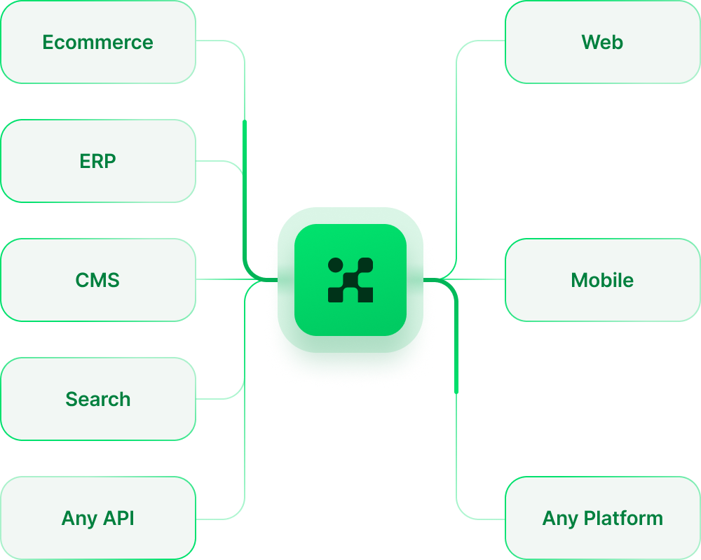
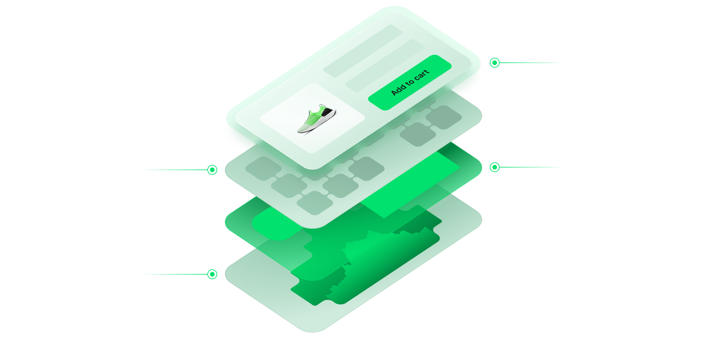

Alokai is your guide to the composable commerce world that simplifies building, deploying, and monitoring ecommerce frontends.

- **Works with any backend**. Alokai is compatible with any backend that has an API. In addition its already integrated with many of them! [See the list of available integrations](https://docs.vuestorefront.io/v2/integrations/#ecommerce-platforms).

- **Working eCommerce Storefront** - Alokai delivers fully-working eCommerce storefront integrated with your favourite stack

## **What you get out-of-the-box** 📦

  

- **Nuxt.js** - the Vue.js framework used to build the application
- **Next.js** - the React.js framework used to build the application
- **Alokai Theme** - fully functional eCommerce theme based on the Storefront UI library
- **Storefront UI** - the Vue.js UI components library used to build the frontend application
- **Alokai Middleware** - the Express.js server used to connect the frontend application with the eCommerce platform and other Integrations

## **Our Tech Stack** 🛠

- [Vue.js](https://vuejs.org/)
- [Nuxt.js](https://nuxtjs.org/)
- [React.js](https://react.dev/)
- [Next.js](https://nextjs.org/)
- [TypeScript](https://www.typescriptlang.org/)
- [Storefront UI](https://storefrontui.io/)
- [Express.js](https://expressjs.com/)
- [GraphQL](https://graphql.org/)
- [Yarn](https://yarnpkg.com/)
- [Docker](https://www.docker.com/)
- [Jest](https://jestjs.io/)

## **Contribution** 🤝

Alokai is an Open Source project and we encourage everyone to help us making it better. 

